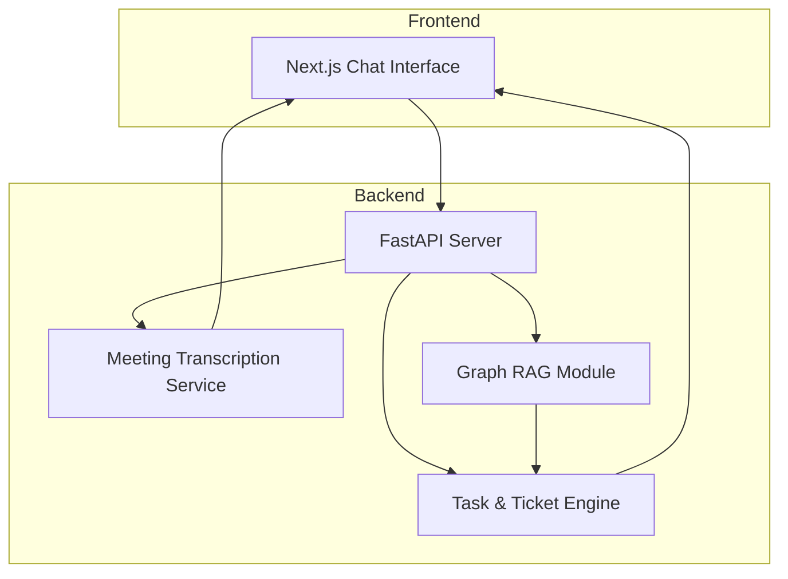
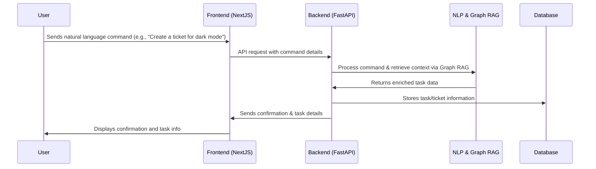
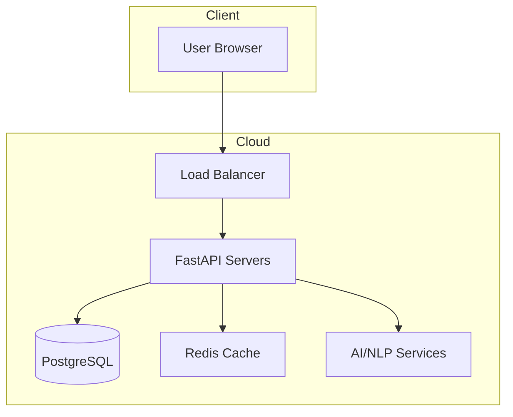

# Ell-ena: AI-Powered Product Manager

Ell-ena is an AI-powered product manager that automates task management by generating to-do items, tickets, and even transcribing meetings—all while keeping the full work context intact. With an intuitive chat interface, Ell-ena lets you interact naturally, turning your casual commands into smart, actionable items. Advanced algorithms like Graph RAG help retrieve context efficiently, making it a powerful tool for modern teams.

## Table of Contents
- [System Overview](#system-overview)
- [Architecture Components](#architecture-components)
- [Technical Stack](#technical-stack)
- [Core Features](#core-features)
- [Workflow Diagrams](#workflow-diagrams)
- [Deployment Architecture](#deployment-architecture)
- [Future Roadmap](#future-roadmap)

## System Overview

Ell-ena is designed to be your all-in-one assistant for managing tasks and meetings. Whether it's creating a ticket for that dark mode feature or adding a to-do item for your math assignment, Ell-ena understands the context and enriches your requests automatically. Built with scalability in mind, it offers real-time task creation and management while leveraging advanced AI and NLP to streamline your workflow.

## Architecture Components

### 1. Frontend Layer
- **Next.js UI**: A modern, responsive interface built with Next.js, offering a slick and interactive user experience.
- **Chat Interface**: A conversational UI that lets you speak to Ell-ena as if chatting with a friend.
- **Context Viewer**: A component that displays detailed task context and progress.

### 2. Backend Layer
- **FastAPI Server**: A high-performance backend API built on FastAPI that processes your commands quickly.
- **Task & Ticket Engine**: Manages the creation, updating, and tracking of tasks and tickets.
- **Meeting Transcription Service**: Transcribes meeting audio in real time and converts it into actionable insights.
- **Graph RAG Module**: Utilizes Graph Retrieval Augmented Generation to efficiently pull and process contextual data.

### 3. Integration & AI Layer
- **NLP and AI Modules**: Power the understanding of natural language inputs and context extraction.
- **Context Manager**: Aggregates and maintains work context across multiple interactions.

### 4. Data & Storage Layer
- **Primary Database**: Stores user data, tasks, tickets, and transcriptions.
- **Cache & Queue System**: Ensures fast real-time processing and task scheduling (using Redis and Celery/RabbitMQ).

## Technical Stack

### Frontend Technologies
```javascript
{
  "framework": "Next.js",
  "styling": "TailwindCSS",
  "state-management": "Redux Toolkit",
  "api-client": "React Query",
  "ui-components": "Custom components or Shadcn/UI"
}
```

### Backend Technologies
```python
{
  "framework": "FastAPI",
  "database": {
    "primary": "PostgreSQL",
    "cache": "Redis"
  },
  "asynchronous": "Celery with RabbitMQ for background tasks",
  "ai": {
    "models": "OpenAI / Custom NLP models",
    "graph-rag": "Graph Retrieval Augmented Generation"
  }
}
```

### Additional Tools
- **Version Control**: Git & GitHub for collaboration.
- **CI/CD**: GitHub Actions to streamline development.
- **Containerization**: Docker for consistent deployment.
- **Cloud Deployment**: AWS, GCP, or Azure to scale with you.

## Core Features

1. **Task & Ticket Automation**
   - Automatically generates actionable to-do items and tickets from natural language commands.
   - Context-aware creation that enriches task details seamlessly.

2. **Meeting Transcription**
   - Real-time transcription of meeting audio.
   - AI-driven generation of summarized notes and action items.

3. **Chat-Based Interface**
   - Intuitive chat interface that makes interacting with Ell-ena feel natural and friendly.
   - Retains context across sessions to deliver personalized task management.

4. **Graph RAG Integration**
   - Employs advanced Graph Retrieval Augmented Generation for context retrieval.
   - Enhances decision-making by analyzing relationships within data graphs.

5. **Scalability**
   - A robust backend designed for real-time task management.
   - Modular architecture that allows for quick feature expansion and integration.

## Workflow Diagrams

### High-Level System Workflow


### Detailed Chat Interaction Workflow


## Deployment Architecture



## Future Roadmap

1. **Enhanced AI Capabilities**
   - Integrate more advanced NLP models and refine Graph RAG processing.
   - Continuously update and optimize context retrieval mechanisms.

2. **Feature Expansion**
   - Expand integration to include calendar, email, and other productivity tools.
   - Develop a mobile application for on-the-go task management.

3. **Security & Compliance**
   - Incorporate additional security measures and conduct regular audits.
   - Enhance user data privacy and comply with international standards.

---
